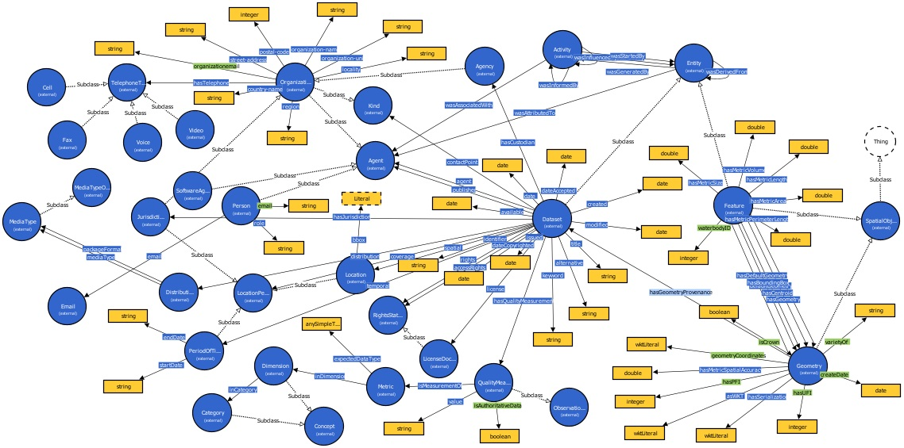
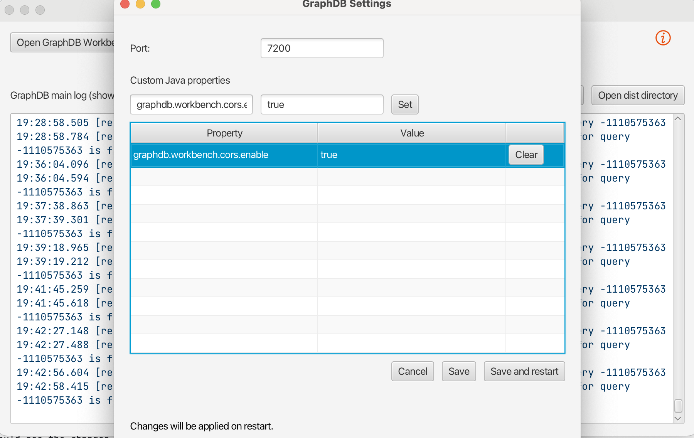
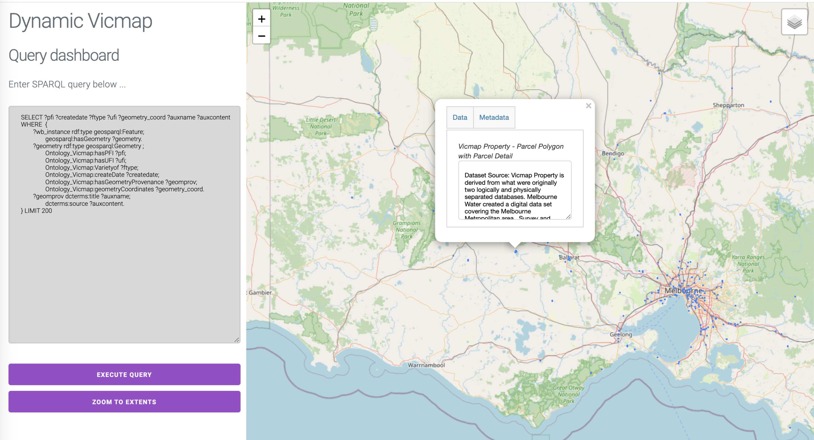

# SMURF: Spatial management, update, and revision framework
This is the repository of source codes and datasets for SMURF (spatial management, update, and revision framework): a common ontological core to support enrichment of foundation spatial data with semantics. The project grew out of the Dynamic Vicmap project---a collaboration between the [RMIT Geographic Knowledge Lab](http://geosensor.net/gkl/), [FrontierSI](https://frontiersi.com.au/), Victorian Government Spatial Services, and the [SmartSat CRC](https://smartsatcrc.com/). The Dynamic Vicmap project tested out SMURF by building a Victorian statewide semantically annotated hydrological knowledge graph, which can be downloaded from this site. 

## Semantic data enrichment
Dynamic Vicmap used SMURF to support semantic spatial data enrichment: extending conventional spatial data and data models with additional ontological structure that provides meaning, background, and context. The semantic dada enrichment process typically has four stages. 
 
1. **Ontology Engineering**: The [SMURF ontology](Ontology/smurf.ttl) has been created based on the following standardized ontology as well as our own created data properties (shown as green):
   
	- smurf: http://geosensor.net/SMURF#
	- prov: http://www.w3.org/ns/prov#
	- foaf: http://xmlns.com/foaf/0.1/
	- xsd_ns: http://www.w3.org/2001/XMLSchema#
	- schema_geo: http://schema.org/
	- dc: http://purl.org/dc/elements/1.1/
	- dcam: http://purl.org/dc/dcam/#
	- owl: http://www.w3.org/2002/07/owl#
	- skos: http://www.w3.org/2004/02/skos/core#
	- terms:  http://purl.org/dc/terms/#
	- vann: http://purl.org/vocab/vann/#
	- xml: http://www.w3.org/XML/1998/namespace
	- dqv: http://www.w3.org/ns/dqv#
	- dcat: http://www.w3.org/ns/dcat#
	- geosparql: http://www.opengis.net/ont/geosparql#
	- ns: http://www.w3.org/2006/vcard/ns#
	- cube: http://purl.org/linked-data/cube#
	- fsdf: https://linked.data.gov.au/def/fsdf/

The below image shows the snapshot of the classes, Object Property (OP), and Data Property (DP) of the SMURF vocabulary where the blue ones are the classes and yellow ones are the DP captured from the previous standardized ontology mentioned above, as well as green ones are DP created by ourselves. 

2. **Data Stage**: This stage has three steps as follows:
	 - *Pre-processing of input data*: four hydro dataset including authoritative data: Waterbody Hydro Polygon and Waterbody Hydro Point, non-authoritative data: Waterbody captured from ML have pre-processed based on: checking their geometry, having consistent attribute names including UFI, PFI, C_DATE_PFI, F_TYPE_COD, and finally checking CRS of different layers to be consistent with authoritative data. 
	 - *Embedded rules:* There are mainly two rules embedded in the script for creating waterbody instances: 1) Intersection: when two polygons are intersected, then they are for the same waterbody. 2) Buffer: when a point within a buffer of a specific distance (e.g., 10m) of a polygon, then the point and polygon are two representations of the same waterbody.
	 - *Creating waterbody instances*: In the final step, the embedded rules are applied to the pre-processed data to return the final waterbody instances (wb_instances). Each waterbody instance shows whether it has a single or multiple representation. 

3. **Building Knowledge Graph (KG)**: The wb_instances are populated into the SMURF ontology to create the Knowledge Graph (KG) of the state of Victoria ([full knowledge graph](https://www.dropbox.com/scl/fi/g8eyvn2upfhck31nfe84z/KG240307.rdf?rlkey=1nnao18gsm7dygrdui1q63pir&st=fsiayzir&dl=0)).
4. **Smart Queries**: By translating the intended questions in natural language into SPARQL language, we will be able to run them over the statewide KG file and retrieve answers. 

In summary, the below chart displays the flowchart of the work including the previous four main steps.

 # Dataset
 The following dataset need to be downloaded to run the script.

 - Waterbody hydro water polygon (HY_WATER_AREA_POLYGON_GeomChecked.shp): download from [here](https://drive.google.com/file/d/1jffwnDnxLL-nxrgUZkWZTyYyuvQGpSzt/view?usp=sharing).
 - Waterbody hydro water point (HY_WATER_AREA_POINT.shp): download from [here](https://discover.data.vic.gov.au/dataset/vicmap-hydro-water-point).
 - Waterbody captured from ML (DamPredictions_Preliminary_V2.shp): download from [here](https://rmiteduau-my.sharepoint.com/:u:/g/personal/nenad_radosevic_rmit_edu_au/EQGB5ZyyKCtKsLczxO96GwkBznVpzB6lTGPj2sa4VIa5Eg?e=xe5h9h).
 - Waterbody captured from LIDAR (bendigo_2020mar05_lakes_mga55.shp): download from [here](https://rmiteduau-my.sharepoint.com/:u:/g/personal/nenad_radosevic_rmit_edu_au/Eebskm02t1NBk2E0w8e2a3AB3FqG9FKk8rn5tZoxEhdTdw?e=jikE6g)
 - Victoria Parcels (Vicmap_Parcels.shp): download from [here](https://discover.data.vic.gov.au/dataset/vicmap-property-property-polygon).
 - Authoritative Floods (VIC_FLOOD_HISTORY_PUBLIC.shp): download from [here](https://discover.data.vic.gov.au/dataset/victorian-flood-history-october-2022-event-public).
 - Non-Authoritative Flood (FullFloodExtents_25Jan_Detailed.shp): download from [here](https://rmiteduau-my.sharepoint.com/:u:/g/personal/nenad_radosevic_rmit_edu_au/EbJygO1VBe9IoEbXnu3x5UsBpXscEmVcsOmZU5w4P1jUhw?e=i72dgO)

# Installation
Dependencies:

-   python 3.5 
-   geopandas
-   rdflib
-   pickle
-   multiprocessing
-   rtree

# How to run
In order to run the main.py script, you have to do the following steps:
- Importing data: the above dataset is fed as input.
- Create wb_instances: This step will create wb_instances.pickle file.
- Creating KG: Our ontology (Ontology_Vicmap.rdf) in the Ontology folder is defined as input along with their Namespaces. Secondly, metadata files are defined for four dataset layers based on the ontology. Finally, the wb_instances created from the previous steps are populated into our ontology and return the [full knowledge graph](https://www.dropbox.com/scl/fi/g8eyvn2upfhck31nfe84z/KG240307.rdf?rlkey=1nnao18gsm7dygrdui1q63pir&st=fsiayzir&dl=0) file as output.

## Queries

 - Importing large rdf file into GraphDB: The created [full knowledge graph](https://www.dropbox.com/scl/fi/g8eyvn2upfhck31nfe84z/KG240307.rdf?rlkey=1nnao18gsm7dygrdui1q63pir&st=fsiayzir&dl=0) file is over 5GB for the whole state, so this should be imported as server files into GraphDB as follows:
	 - Create a folder with the name _graphdb-import_ in your GraphDB's server directory (on Mac OS it is in _~/_ or equivalently _/Users/my_username_), and then place the downloaded rdf file there. 
	 - Restart the Graphdb workbench and go to the import tab.
         - You should see the rdf file name under the server files. 
	 - Finally, provide the IRI of the rdf file (You can find this in [the smurf.ttl file](/Ontology/smurf.ttl) (line 1 in the file), it should be successfully imported into the online GraphDB workbench.

- You can find the list of SPARQL queries in the in the [Queries folder](Queries) where you can run those over the imported Knowledge Graph (KG for the whole state) in GraphDB and retrieve answers.
 
## AWS EC2 instance
We tested this work on the AWS and the following EC2 instances:
- C6I 32xlarge for creating Knowldge Graph for the whole state. 
- R3.2xlarge for running queries in GraphDB desktop.

## Processing time

The following table shows the processing time in different steps in AWS:
|                                                       | EC2 instance | CPUs | RAMs | Processing time |
|-------------------------------------------------------|--------------|------|------|--------------|
| **Data stage** (Loading dataset, creating   wb_instances) | c6i.32xlarge | 128  | 256  | 2.5 hrs      |
| **Populating KG** (~2 millions data instances)                   | c6i.32xlarge | 128  | 256  | 10.23 min    |
| **Loading the KG rdf file into GraphDB**                     | R3-2XL       | 8    | 61   | 9 min       |
| **Querying over the KG**                            | R3-2XL       | 8    | 61   | 3.5 min      |

## Web query visualisation set up

To run the web query visualisation dashboard, first CORS in GraphDB must be enabled. 

1. Open settings in GraphDB desktop
1. Add a custom Java property: 'graphdb.workbench.cors.enable', value: 'true'
1. Set the property, then save and restart GraphDB
1. After GraphDB restart, confirm changes have been applied by checking Help -> System Information -> Configuration parameters.

Before running the web query visualisation dashboard, the local SPARQL endpoint URL must be specified in the dashboard HTML file, e.g., [vicmap.html](VisualisationDashboard/vicmap_main_050324.html). 

1. In GraphDB, go to Setup -> Repositories
1. Copy the repository URL to the clipboard using the link icon by the repository to use
1. Open the relevant visualisation dashboard HTML file using a text editor (ideally make your own copy so as not to overwrite others' work when committing). 
1. Search for 'const endpointUrl = '
	- const endpointUrl = 'http://localhost:7200/repositories/YOUR_REMOTE_GRAPHDB_ENDPOINT';

Run the web query visualisation dashboard by opening the HTML file in a web browser. 

There are different javascript libraries included:
- Leaflet
- Proj4
- wellknown (this needs to be installed through npm install wellknown)

## Web query visualisation dashboard
The below image shows the web query visualisation dashboard which has the following sections:
- GeoSPARQL endpoint 
- Map view to show the GeoSPARQL results on map

You can access the public URL link for the map in [here](https://staging.d7eba651akmya.amplifyapp.com/). Currently the dashboard is inactive, but to check the user interaction with our web query visualisation dashboard please watch this [video](https://www.youtube.com/watch?v=TlwnLCJ4Isg). For more info please contact the listed contributors below. 

## Contributors
- Mohammad Kazemi Beydokhti
- Nenad Radosevic
- Matt Duckham
- Yaguang Tao

## Acknowledgements to the Dynamic Vicmap Team
- Luc Houselander
- Yang Chen
- Andrew Mellor
- Cristhiane Ramos
- Sabah Mirza
- Allison Kealy
- David Blain
- Jacqueline Denham
- Nathaniel Jeffrey
- Aastha Sharma
- Katherine Williams
- Jessica Keysers

